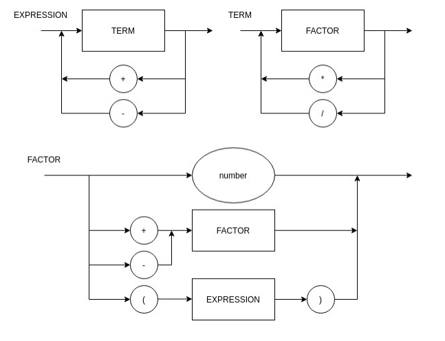

#### compylador

Para utilizar o compilador, passe a string como parâmetro único para o executável  executaveis/{windows|linux}/compylador.exe

#### EBNF

'''
EXPRESSION = TERM, { ("+" | "-"), TERM } ;

TERM = FACTOR, { ("*" | "/"), FACTOR } ;

FACTOR = ("+" | "-") FACTOR | "(" EXPRESSION ")" | number ;

'''
