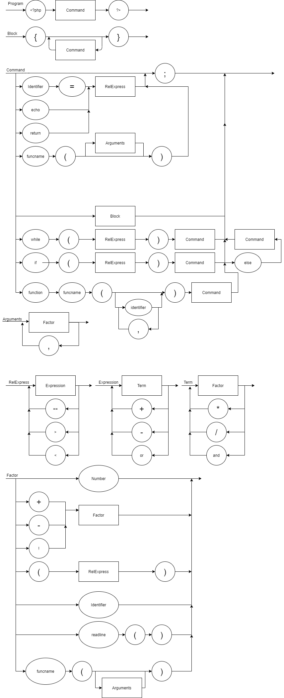

#### sharp_php_compiler

Esse é um compilador mínimo de PHP escrito em C#, suportando instruções básicas (aritméticas, lógicas, branches e loops). 

O código na branch master implementa um interpretador, enquanto a branch `asm` tem instruções para compilar e fazer o link em um executável. 

Para utilizar o compilador, passe o nome do arquivo a ser lido como parâmetro único para o executável  executaveis/{windows|linux}/compylador.exe

#### EBNF

'''

PROGRAM : '<?php' COMMAND '?>'

BLOCK : '{' {COMMAND} '}'

COMMAND : (\[ ((IDENT '=' | 'echo') RELEX)\] ';') | (BLOCK | 'while' '(' RELEX ')' COMMAND | 'if' '(' RELEX ')' COMMAND [ 'else' COMMAND ])

RELEX : EXPRESSION  { ('==' | '>' | '<') EXPRESSION}

EXPRESSION = TERM, { ('+' | '-' | 'or'), TERM } 

TERM = FACTOR, { ('*' | '/' | 'and'), FACTOR }

FACTOR = ('+' | '-' | '!' ) FACTOR | "(" RELEX ")" | number | IDENT | READLINE '(' ')' 

'''

#### Novos nós:

If|else:

Dois ou três nós. O primeiro é sempre a condição e o segundo é um comando (ou bloco) que roda se a condição for verdadeira. Caso seja falsa, e exista um terceiro nó, ele é quem roda.

While:

Dois nós. O primeiro té uma condição que, enquanto for verdadeira, o segundo nó é "evaluado"

Readline:

Nó que não tem filhos, porém em sua 'evaluação' aciona um input que deve receber um inteiro

## Questionario

a symbol table deve guardar para todas as variáveis o seu respectivo tipo, enquanto as operações precisarão checar se o tipo é compatível para tal.
